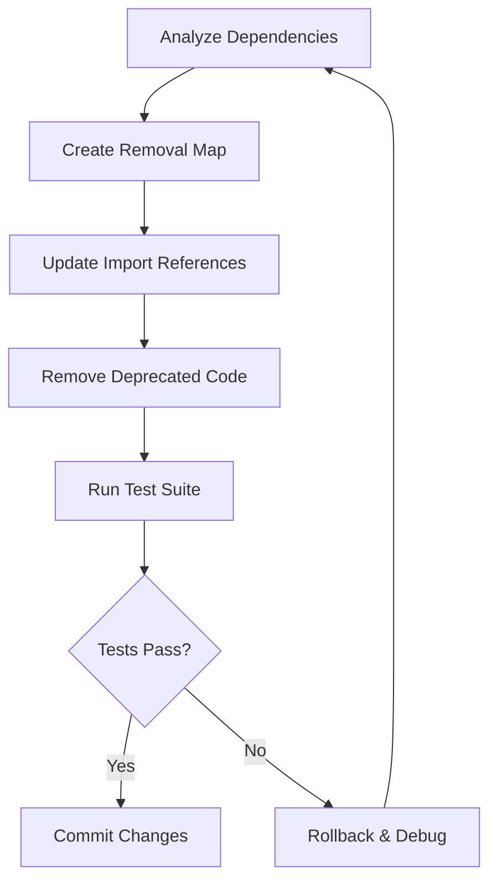

# Architecture Analysis: Remove Deprecated Methods and Fallback Mechanisms

## Context Analysis

This architectural task addresses the systematic removal of technical debt accumulated across multiple versions of the aisanity codebase. The deprecated code represents legacy compatibility layers that were maintained during the transition from a worktree-centric to a workspace-centric architecture. The cleanup targets approximately 200-300 lines of deprecated code across 5 core files, with varying risk levels that require careful sequencing.

**Current State Assessment:**
- **Deprecated Interfaces**: `WorktreeStatusRow` and related functions in `status.ts` marked for v2.0.0 removal
- **Disabled Fallback Strategies**: Commented-out code blocks in `container-utils.ts` that were too broad/inclusive
- **Legacy Configuration Handling**: Old `workspace_branch` format support in `config.ts`
- **Backward Compatibility Wrappers**: `discoverContainers()` function maintained for older API compatibility
- **Test Coverage**: Regression tests specifically for deprecated functionality

## Technology Recommendations

### Code Cleanup Strategy
- **Incremental Removal**: Prioritize high-priority, low-risk items first to build confidence
- **Dependency Analysis**: Map all imports and references before removal to prevent breaking changes
- **Test-Driven Approach**: Ensure comprehensive test coverage for modern implementations before cleanup

### Risk Mitigation Patterns
- **Semantic Versioning**: Align with v2.0.0 release to justify breaking changes
- **Feature Flags**: Consider temporary flags for medium-risk items during transition
- **Rollback Planning**: Maintain git tags for easy reversion if issues arise

## System Architecture

### Current Architecture Layers

```
┌─────────────────────────────────────────────────────────────┐
│                    Command Layer                             │
│  ┌─────────────────┐  ┌─────────────────┐  ┌──────────────┐ │
│  │   status.ts     │  │   cleanup.ts    │  │   stop.ts    │ │
│  │  (deprecated)   │  │                 │  │              │ │
│  └─────────────────┘  └─────────────────┘  └──────────────┘ │
└─────────────────────────────────────────────────────────────┘
                                │
┌─────────────────────────────────────────────────────────────┐
│                   Utility Layer                              │
│  ┌─────────────────┐  ┌─────────────────┐  ┌──────────────┐ │
│  │ container-utils │  │    config.ts    │  │worktree-utils│ │
│  │ (fallback code) │  │ (legacy config) │  │              │ │
│  └─────────────────┘  └─────────────────┘  └──────────────┘ │
└─────────────────────────────────────────────────────────────┘
                                │
┌─────────────────────────────────────────────────────────────┐
│                    Test Layer                               │
│  ┌─────────────────┐  ┌─────────────────┐  ┌──────────────┐ │
│  │status-regression│  │  basic.test.ts  │  │ integration  │ │
│  │    .test.ts     │  │                 │  │   tests      │ │
│  └─────────────────┘  └─────────────────┘  └──────────────┘ │
└─────────────────────────────────────────────────────────────┘
```

### Target Architecture (Post-Cleanup)

```
┌─────────────────────────────────────────────────────────────┐
│                    Command Layer                             │
│  ┌─────────────────┐  ┌─────────────────┐  ┌──────────────┐ │
│  │   status.ts     │  │   cleanup.ts    │  │   stop.ts    │ │
│  │ (modern only)   │  │                 │  │              │ │
│  └─────────────────┘  └─────────────────┘  └──────────────┘ │
└─────────────────────────────────────────────────────────────┘
                                │
┌─────────────────────────────────────────────────────────────┐
│                   Utility Layer                              │
│  ┌─────────────────┐  ┌─────────────────┐  ┌──────────────┐ │
│  │ container-utils │  │    config.ts    │  │worktree-utils│ │
│  │ (clean code)    │  │ (modern config) │  │              │ │
│  └─────────────────┘  └─────────────────┘  └──────────────┘ │
└─────────────────────────────────────────────────────────────┘
                                │
┌─────────────────────────────────────────────────────────────┐
│                    Test Layer                               │
│  ┌─────────────────┐  ┌─────────────────┐  ┌──────────────┐ │
│  │status-regression│  │  basic.test.ts  │  │ integration  │ │
│  │    .test.ts     │  │                 │  │   tests      │ │
│  │ (updated)       │  │                 │  │              │ │
│  └─────────────────┘  └─────────────────┘  └──────────────┘ │
└─────────────────────────────────────────────────────────────┘
```

## Integration Patterns

### Phase-Based Removal Strategy

**Phase 1: High Priority (Safe Now)**
- Remove disabled fallback code blocks (commented sections)
- Remove deprecated test cases
- Update imports for simple wrapper functions
- **Risk Level**: Low
- **Files**: 3 files, ~50 lines

**Phase 2: Medium Priority (v2.0.0)**
- Remove deprecated interfaces and functions
- Remove legacy configuration handling
- Update all dependent code
- **Risk Level**: Medium
- **Files**: 2 files, ~200 lines

### Dependency Management Pattern



## Implementation Guidance

### IMPORTANT: Critical Decision Points

1. **Version Alignment**: Target v2.0.0 release for medium-risk items to justify breaking changes
2. **Test Coverage**: Ensure modern implementations have comprehensive test coverage before removal
3. **Documentation Updates**: Update any user-facing documentation that references deprecated APIs
4. **Migration Guide**: Create clear migration documentation for any external users of deprecated APIs

### Phase 1: Safe Removals (Immediate)

**Files to Clean:**
- `container-utils.ts`: Remove commented fallback strategies (lines 248-271, 756-773)
- `status-regression.test.ts`: Remove tests for deprecated functionality (~15 lines)
- Update imports in `cleanup.ts` and `stop.ts` to use modern functions

**Implementation Steps:**
1. Remove commented code blocks in `container-utils.ts`
2. Remove deprecated test cases in `status-regression.test.ts`
3. Update import statements to use `discoverAllAisanityContainers()` instead of `discoverContainers()`
4. Run full test suite to verify no regressions

### Phase 2: Medium Risk Removals (v2.0.0)

**Files to Clean:**
- `status.ts`: Remove deprecated interfaces and functions (~150 lines)
  - `WorktreeStatusRow` interface
  - `mapContainersToWorktrees()` function
  - `getContainerStatusWithPorts()` function
  - `formatWorktreeTable()` function
  - `generateWorktreeSummary()` function
- `config.ts`: Remove legacy configuration handling (~50 lines)
  - Old `workspace_branch` format support

**Implementation Steps:**
1. Verify all code uses modern `WorkspaceStatusRow` interface
2. Ensure `groupContainersByWorkspace()` is used everywhere
3. Remove legacy config parsing logic
4. Update any remaining import references
5. Run comprehensive test suite

### Risk Mitigation Strategies

**Pre-Removal Validation:**
- Use static analysis to find all references to deprecated functions
- Create comprehensive test coverage for modern implementations
- Document migration paths for any external API users

**Post-Removal Verification:**
- Full test suite execution
- Integration testing with real Docker environments
- Performance benchmarking to ensure no regressions
- Documentation review and updates

### Testing Strategy

**Before Removal:**
- Ensure 100% test coverage for modern implementations
- Create regression tests for critical user workflows
- Benchmark performance of current vs. modern implementations

**After Removal:**
- Run full test suite (unit + integration)
- Test with various Docker configurations
- Validate error handling and edge cases
- Performance testing to ensure no degradation

## Considerations

### Security Architecture
- **Container Discovery**: Modern implementation uses stricter label-based discovery, reducing security surface
- **Configuration Parsing**: Removal of legacy config formats reduces attack surface
- **Input Validation**: Modern functions have improved validation and error handling

### Performance Optimization
- **Reduced Code Paths**: Elimination of fallback strategies reduces execution complexity
- **Memory Usage**: Removal of unused interfaces and functions reduces memory footprint
- **Startup Time**: Cleaner codebase improves module loading performance

### Maintainability Improvements
- **Code Clarity**: New developers won't encounter confusing deprecated code
- **Reduced Complexity**: Fewer code paths and conditional branches
- **Better Documentation**: Cleaner separation between modern and legacy functionality

### Future-Proofing
- **Deprecation Policy**: Establish clear timelines for future deprecations
- **Automated Detection**: Implement linting rules to detect deprecated function usage
- **Version Planning**: Align breaking changes with semantic versioning strategy

## Success Metrics

**Quantitative Metrics:**
- Lines of code removed: 200-300 lines
- Test coverage maintained: ≥95%
- Performance impact: <5% degradation
- Build time impact: <10% increase

**Qualitative Metrics:**
- Code readability improvement
- Reduced onboarding time for new developers
- Cleaner API surface for external users
- Improved maintainability scores

This architectural plan provides a structured approach to safely removing deprecated code while preserving functionality and improving the overall quality of the aisanity codebase.