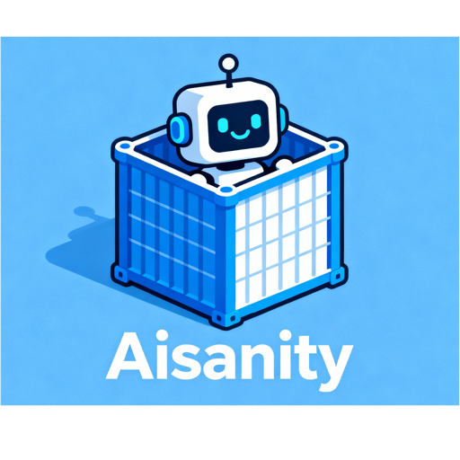

<div align="center">
  
</div>

Aisanity is a secure, hassle-free tool for running AI agents in isolated environments, protecting your host OS from risks while enabling seamless development workflows. It provides sandboxed containers with automatic AI integration, git worktree support for parallel development, and compatibility with any IDE or terminal tool.

## Tool Compatibility

Aisanity works with all development tools and IDEs. While opencode is the primary tool of interest and automatically integrated into all development environments, you can use any development tool you prefer:

- **VSCode** - Full devcontainer support with automatic configuration
- **IntelliJ IDEA** - Compatible with devcontainer environments
- **Vim/Neovim** - Works seamlessly with containerized development
- **Emacs** - Full integration with devcontainer workflows via TRAMP (just use /docker)
- **Any terminal-based tool** - Access containers via `aisanity run`

All devcontainer templates include automatic opencode installation and configuration, but you're not required to use it.

## Installation

### Option 1: Bun Runtime (Recommended for Performance)

Install Bun for optimal performance (4x faster startup, 100x faster tests):

```bash
# Install Bun runtime
curl -fsSL https://bun.sh/install | bash

# Install Aisanity with Bun
bun install -g aisanity
```

### Option 2: Node.js Runtime (Compatible)

Traditional Node.js installation with full backward compatibility:

```bash
# Install with npm (Node.js)
npm install -g aisanity
```

### Option 3: Standalone Executable

Download the platform-specific executable from the [GitHub Releases](https://github.com/your-username/aisanity/releases) page:

#### macOS (Apple Silicon)
```bash
# Download aisanity-macos-arm64
chmod +x aisanity-macos-arm64
./aisanity-macos-arm64 --help
```

#### Linux (x64)
```bash
# Download aisanity-linux-x64
chmod +x aisanity-linux-x64
./aisanity-linux-x64 --help
```

#### Windows (x64)
```bash
# Download aisanity-win-x64.exe
.\aisanity-win-x64.exe --help
```

**Optional**: Verify checksum for security:
```bash
# macOS/Linux
shasum -a 256 aisanity-macos-arm64
# Compare with the .sha256 file in releases

# Windows
certutil -hashfile aisanity-win-x64.exe SHA256
```

### Performance Comparison

| Runtime | Startup Time | Test Execution | Memory Usage |
|---------|-------------|---------------|--------------|
| Bun     | ~70ms       | ~50ms         | 25-40% less  |
| Node.js | ~300ms      | ~5s           | Baseline     |

### Development Setup

For developers contributing to Aisanity:

```bash
# Clone repository
git clone <repository-url>
cd aisanity

# Install dependencies with Bun (recommended)
bun install

# Run development
bun run dev

# Run tests
bun test

# Build for distribution
bun run build
```

## Usage

### Initialize Workspace

First, initialize your workspace:

```bash
aisanity init
```

This creates:
- `.aisanity` configuration file with workspace settings
- Workspace-specific configuration files

### Git Worktree Commands

Aisanity provides comprehensive git worktree support for parallel development workflows.

Worktree support is *disabled* by default, to enable you need to modify the .aisanity setting. Set `worktree: true` and you're good to go.

#### Create a New Worktree

Create a new worktree with automatic container setup:

```bash
# Create a new worktree for a feature branch
aisanity worktree create feature-auth

# Create a worktree without switching to it
aisanity worktree create feature-ui --no-switch

# Enable verbose logging
aisanity worktree create feature-bugfix --verbose
```

This will:
- Create a git worktree in `worktrees/<branch-name>/`
- Copy `.aisanity` configuration from main workspace
- Copy `.devcontainer` configuration from main workspace (even if not in .git)
- Switch to the new worktree (by default)

#### List All Worktrees

View all worktrees and their container status:

```bash
aisanity worktree list
```

Example output:
```
Worktrees for this repository:

→ Main Workspace (active)
   Path: /path/to/project
   Branch: main
   Container: project-main
   Status: Running (Up 2 hours)
   Config: /path/to/project/.aisanity

Additional Worktrees:

  feature-auth
   Path: /path/to/project/worktrees/feature-auth
   Branch: feature-auth
   Container: project-feature-auth
   Status: Running (Up 1 hour)
   Config: /path/to/project/worktrees/feature-auth/.aisanity

  feature-ui
   Path: /path/to/project/worktrees/feature-ui
   Branch: feature-ui
   Container: project-feature-ui
   Status: Stopped (Exited 2 days ago)
   Config: /path/to/project/worktrees/feature-ui/.aisanity

Current worktree: feature-auth
```

#### Check a Worktree

Check worktree status and display information:

```bash
aisanity worktree check feature-ui
```

#### Remove a Worktree

Remove a worktree and clean up associated containers:

```bash
aisanity worktree remove feature-auth
```

This will:
- Stop and remove the worktree's container
- Delete the worktree directory
- Clean up git worktree references

### Run Commands in Container

Run any command inside the devcontainer:

```bash
# Run a shell in current workspace/worktree
aisanity run

# Run in a specific worktree
aisanity run --worktree feature-auth

# Run specific commands
aisanity run echo "Hello from container!"
aisanity run npm install
```

### Check Status

View the status of containers for your workspace:

```bash
# Status of current workspace/worktree
aisanity status

# Status of specific worktree
aisanity status --worktree feature-auth
```

### Stop Containers

Stop all containers related to your workspace:

```bash
# Stop current workspace/worktree containers
aisanity stop

# Stop all worktree containers
aisanity stop --all-worktrees

# Stop specific worktree containers
aisanity stop --worktree feature-auth
```

## Worktree Workflows

### Parallel Development Example

```bash
# Start in main workspace
cd /path/to/project

# Create worktree for authentication feature
aisanity worktree create feature-auth

# Create worktree for UI improvements
aisanity worktree create feature-ui

# List all worktrees to see status
aisanity worktree list

# Check authentication worktree status
aisanity worktree check feature-auth

# Work on authentication feature
aisanity run
# Inside container: work on auth code...

# Check UI worktree status
aisanity worktree check feature-ui

# Work on UI improvements
aisanity run
# Inside container: work on UI code...

# Both worktrees have isolated containers and can be developed in parallel
```

### Hotfix Workflow

```bash
# Working on a feature in a worktree
aisanity worktree create feature-new-api

# Urgent hotfix needed - create hotfix worktree
aisanity worktree create hotfix-security-patch

# Check hotfix worktree status
aisanity worktree check hotfix-security-patch

# Fix the issue
aisanity run
# Inside container: implement security fix...

# Test and deploy hotfix
git commit -m "Fix security vulnerability"
git push origin hotfix-security-patch

# Check feature worktree status
aisanity worktree check feature-new-api
```

### Code Review Workflow

```bash
# Create worktree for reviewer
aisanity worktree create review-pr-123

# Check review worktree status
aisanity worktree check review-pr-123

# Pull the PR branch
git fetch origin pull/123/head:pr-123
git checkout pr-123

# Review the code in isolated environment
aisanity run
# Inside container: review and test the PR...

# Remove review worktree when done
aisanity worktree remove review-pr-123
```

## Migration Notes for Existing Users

### Upgrading from Non-Worktree Workflows

If you're an existing Aisanity user, your workflows remain unchanged. The worktree integration is completely backward compatible:

1. **Your current workspace continues to work exactly as before**
2. **Container naming preserves original behavior for main workspace**
3. **All existing commands (`run`, `stop`, `status`) work without modification**

### Migrating to Worktree Workflows

To start using worktree features:

```bash
# Your existing setup continues to work
aisanity run  # Still works in main workspace

# When ready for parallel development:
aisanity worktree create feature-branch

# Worktrees automatically inherit your .aisanity configuration
# Each worktree gets its own isolated container
```

### Recommended Directory Structure Changes

When you start using worktrees, your project structure will look like:

```
a_project/
├── a_project/                 # Main workspace .git directory
│   ├── .git/
│   ├── .aisanity              # Main workspace config
│   └── .devcontainer/         # Main workspace devcontainer
│       └── devcontainer.json
├── worktrees/                 # Worktree directory
│   ├── feature-auth/
│   │   ├── .aisanity          # Worktree-specific config
│   │   ├── .devcontainer/     # Worktree-specific devcontainer
│   │   │   └── devcontainer.json
│   │   └── a_project/         # Linked to main .git
│   └── feature-ui/
│       ├── .aisanity          # Worktree-specific config
│       ├── .devcontainer/     # Worktree-specific devcontainer
│       │   └── devcontainer.json
│       └── a_project/         # Linked to main .git
```

## Configuration

The `.aisanity` file contains workspace configuration:

```yaml
workspace: project_main
containerName: aisanity-project_main
```

### Worktree-Specific Configuration

Each worktree gets its own `.aisanity` file copied from the main workspace. You can customize worktree-specific settings:

```yaml
# In worktrees/feature-auth/.aisanity
workspace: project_main
env:
  FEATURE_AUTH_ENABLED: "true"
  DATABASE_URL: "postgresql://localhost:5432/auth_db"
```

## Requirements

- Docker
- Devcontainers CLI (`npm install -g @devcontainers/cli`)
- **Bun >= 1.0.0** (recommended for optimal performance)
- **Node.js >= 22.x** (supported for backward compatibility)


## Opencode integration

By default, Aisanity uses OpenCode as the preferred AI coding agent. It mounts OpenCode-specific paths to share session logs, state, configuration, and other data. Additionally, OpenCode is installed by default in all containers. There's nothing magical about this integration - it's simply automated setup. If you don't want to use OpenCode, you can modify the generated template (which you'll likely need to customize anyway).

## Devcontainer Integration

Aisanity automatically creates devcontainer configurations during `aisanity init` based on your project type. No manual setup is required.

If you have already .devcontainer based setup then most likely you want to add opencode specific paths in the mounts (or other AI coding agent).

### Automatic Project Detection

When you run `aisanity init`, Aisanity detects your project type and generates an appropriate devcontainer configuration:

- **Python projects** - Python 3.11 with uv, ruff, and opencode integration
- **Node.js projects** - Node.js 18 with TypeScript and Tailwind support
- **Go projects** - Go 1.21 with Go extensions and tools
- **Rust projects** - Rust toolchain with rust-analyzer
- **Java projects** - Java 17 with Java Development Pack
- **Unknown projects** - Base Ubuntu environment with Node.js

### Auto-Generated Configuration Examples

#### Python Project Example
```json
{
  "name": "Python Development",
  "image": "mcr.microsoft.com/devcontainers/python:3.11",
  "features": {
    "ghcr.io/devcontainers/features/node:1": {
      "version": "lts"
    },
    "ghcr.io/gvatsal60/dev-container-features/uv:0": {},
    "ghcr.io/jsburckhardt/devcontainer-features/ruff:1": {}
  },
  "forwardPorts": [5000, 8000],
  "mounts": [
    "source=${localEnv:HOME}/.config/opencode,target=/home/vscode/.config/opencode,type=bind,consistency=cached",
    "source=${localEnv:HOME}/.local/share/opencode,target=/home/vscode/.local/share/opencode,type=bind,consistency=cached",
    "source=${localEnv:HOME}/.local/state/opencode,target=/home/vscode/.local/state/opencode,type=bind,consistency=cached"
  ],
  "postCreateCommand": "npm install -g opencode-ai",
  "remoteUser": "vscode"
}
```

#### Node.js Project Example
```json
{
  "name": "Node.js Development",
  "image": "mcr.microsoft.com/devcontainers/javascript-node:18",
  "features": {
    "ghcr.io/devcontainers/features/node:1": {
      "version": "lts"
    }
  },
  "forwardPorts": [3000, 3001],
  "mounts": [
    "source=${localEnv:HOME}/.config/opencode,target=/home/node/.config/opencode,type=bind,consistency=cached",
    "source=${localEnv:HOME}/.local/share/opencode,target=/home/node/.local/share/opencode,type=bind,consistency=cached",
    "source=${localEnv:HOME}/.local/state/opencode,target=/home/node/.local/state/opencode,type=bind,consistency=cached"
  ],
  "postCreateCommand": "npm install -g opencode-ai",
  "remoteUser": "node"
}
```

### Cross-Platform Compatibility

Devcontainers provide consistent development environments across all tools and platforms:

- **Tool Agnostic**: Works with any IDE or development tool
- **Environment Consistency**: Same dependencies and configurations everywhere
- **Opencode Integration**: Automatic installation and configuration in all templates
- **Configuration Mounting**: Your local opencode settings are automatically available in containers

All templates include automatic opencode installation and proper directory mounting for seamless integration with your existing opencode configuration.

## Architecture

- **Workspace Naming**: `{folder_name}_{branch_name}` (sanitized)
- **Mounting**: Current directory → `/workspace` in container
- **Configuration**: Local tool configurations mounted to containers
- **Container Management**: Uses devcontainers CLI for lifecycle management


## FAQ

### Container Names

In the .aisanity file, there are two options for naming containers:

1. **Default Naming**: `{workspace}_{branch_name}` (sanitized)
2. **Custom Naming**: You can specify a custom name using the `containerName` property in the .aisanity file.

What's a workspace? It's literally the directory where you run the command. It can also be set to anything you want. Sharing that name with other workspaces will *reuse* the containers BUT also destroy them if you delete the workspace.

Why would you want to set `containerName`? By default, each branch gets a completely isolated environment to fully isolate the environments. Setting the `containerName` to something static will remove that functionality.

### Worktrees

You don't need to use worktrees. Aisanity works perfectly with standard branching workflows, but this approach limits your ability to run multiple development sessions simultaneously.

### Rebuild the Container

To rebuild the container, run the following command:

```bash
aisanity rebuild
```

If you want to rebuild the container from scratch, pass the `--clean` flag to the command:

```bash
aisanity rebuild --clean
```

You might want to rebuild the container if something goes wrong inside the container and you need to start fresh.
